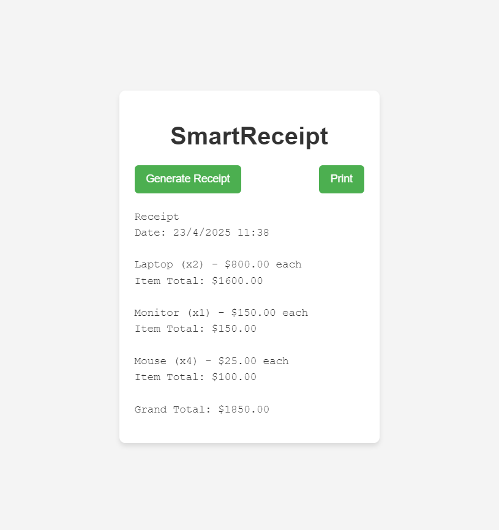

# SmartReceipt - Generate and Print Receipts Online

Welcome to **SmartReceipt**, a simple and elegant web-based solution for generating and printing detailed receipts for customer orders. This application allows users to easily create itemized receipts, view the total amount, and print the receipts directly from the browser.

## Features:
- Generate dynamic receipts with item names, quantities, prices, and total costs.
- Display detailed receipt information along with the date and time of generation.
- Print receipts directly from the web application with a single click.
- Stylish, easy-to-use interface for a seamless experience.

## Screenshot:


## Technologies Used:
- **HTML**: Structure of the receipt page.
- **CSS**: Styling the page to make it visually appealing.
- **JavaScript**: Dynamically generating the receipt and calculating totals.

## How to Use:
1. **Clone the Repository**: Clone this repository to your local machine.
   ```bash
   git clone https://github.com/batuhanbakirtass
   ```
2. **Open the Files**: Open the `index.html` file in your browser.
3. **Generate a Receipt**: Click on the "Generate Receipt" button to display the receipt.
4. **Print the Receipt**: Use the "Print" button to directly print the receipt.

## How to Contribute:
1. Fork the repository.
2. Create a new branch (`git checkout -b feature-branch`).
3. Commit your changes (`git commit -am 'Add new feature'`).
4. Push to the branch (`git push origin feature-branch`).
5. Open a pull request to the main repository.

## License:
This project is open-source and available under the [MIT License](LICENSE).

---

Created with ❤️ by [Batuhan Bakırtaş](https://github.com/batuhanbakirtass)
```
